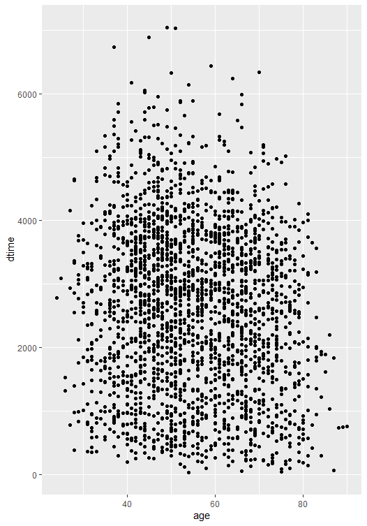

```{r setup, include=FALSE}
knitr::opts_chunk$set(echo = FALSE, message = FALSE, warning = FALSE)
library(survival)
library(tidyverse)
library(tidymodels)
library(arsenal)
```

## Presentation Outline

- Background / Research question of interest
- Exploratory Analysis
- Methods
  - Cox Proportional Hazard with Elastic Net
  - Survival Random Forest
  - Conformalized Analysis
- Results
- Discussion

## Background

- We analyzed the Rotterdam data set from the `survival` package in R. This data includes `r nrow(rotterdam)` breast cancer patients from the Rotterdam tumor bank.
- Notable measurements include age, menopausal status, tumor size, number of effected lymph nodes, and other baseline variables.
- Interventions were hormone treatment and chemotherapy.
- Subjects were followed until death or loss to follow up with occurrences of remission and death being recorded.

```{r example slide table}
set.seed(2022)

rotterdam_split <- initial_split(rotterdam, prop = 0.8, strata = death)
rotterdam_training <- training(rotterdam_split)
rotterdam_test <- testing(rotterdam_split)

head(rotterdam_training, 5) %>% 
  select(-1) %>% 
  remove_rownames() %>% 
  knitr::kable() %>% 
  kableExtra::kable_styling(latex_options = "scale_down")
```

## Exploratory Analysis

>- Example: You can add arrows ">-"

```{r results='asis'}
print(summary(tableby(~age+meno+size+grade+nodes+pgr+er+chemo+hormon+dtime+death,
                      rotterdam,numeric.simplify = TRUE, numeric.test = "kwt")))

```


<!-- This is a comment that won't appear in the presentation -->

## Methods

- We can use code chunks to illustrate plots

```{r example plot}
rotterdam_training %>% 
  ggplot(aes(x = age, y = dtime)) +
  geom_point()
```

## Methods

- Or you can also insert images like this (but the image dimensions have to be correct):



## Log-rank Test - Hormon

```{r include=FALSE}
rotterdam1 <- 
  rotterdam %>% 
  mutate(
    trt_label = case_when(
      hormon == 1 & chemo == 1 ~ "hormon+chemo",
      hormon == 1 & chemo == 0 ~ "hormon",
      hormon == 0 & chemo == 1 ~ "chemo",
      hormon == 0 & chemo == 0 ~ "none"
    ))
```

- Hypothesis
  - $H_0: S_{hormon}(t) = S_{control}(t)$; $H_a: S_{hormon}(t) \ne S_{control}(t)$.

- Log-rank test
  - The test statistic is 23.7, and corresponding p-value is $1.13^{-6}$ < 0.05, reject $H_0$ and conclude: we are 95% confident that the survival probability function of hormon group and control group are significantly different;
  - The test statistic is positive, thus conclude that hormon treatment is effective to the survival of patients with breast cancer.

## Log-rank Test - Hormon (Continued)


## Log-rank Test - Chemotherapy

- Hypothesis
  - $H_0: S_{chemo}(t) = S_{control}(t)$; $H_a: S_{chemo}(t) \ne S_{control}(t)$.

- Log-rank test
  - The test statistic is 0.495, and corresponding p-value is 0.48 > 0.05, fail to reject $H_0$ and conclude that there are no difference between the survival probability function of chemotherapy group and control group;
  - Chemotherapy is not effective to breast cancer.

## Log-rank Test - Chemotherapy (Continued)


## Log-rank Test - Hormon + Chemotherapy

- Regroup
  - 4 groups: hormon+chemo, hormon only, chemo only and none.

- Hypothesis
  - $H_0: S_{hormon+chemo}(t) = S_{hormon}(t) = S_{chemo}(t) = S_{none}(t)$; 
  - $H_a: at \ least \ two \ survival \ functions \ are \ not \ equal$.
  
- Log-rank test
  - The test statistic is 40.4, and corresponding p-value is $9^{-9}$ < 0.05, reject $H_0$.
  
## Log-rank Test - Hormon + Chemotherapy (Continued)


- Chemotherapy or Hormon alone does not have treatment effect on breast cancer?
- Hormon combining with chemotherapy can improve the survival of breast cancer?

## Log-rank Test - Hormon + Chemotherapy (Discussion)

```{r}
table(rotterdam1$trt_label) %>% 
  knitr::kable()
```

- Discussion
  - The sample size of hormon+chemo group is 28;
  - Within hormon treatment group, only 8% people receive chemotherapy at the same time.

- Conclusion
  - Reserve the results of the two previous separate log-ranks tests.
  
## Prediction

- Random Survival Forest
- Cox/Cox with Elastic Net
- Comparison with Brier Score
  
## Random Survival Forest

- For a single survival tree:
  - Assign subjects to groups based on certain splitting rules regarding their covariates;
  - The subjects in each group will share a similar survival behavior;
  - Estimate survival probability of a given data point based on its "neighbors".
  
- Assemble trees: Random Survival Forest (RSF)
  - use `ranger` package to train RSF;
  - non-parametric approach, no interpretable parameters;
  - prediction result for a single subject:
    - 7th subject in test data set, with pid = 58.

## Random Survival Forest - Example


- Estimated median survival time: 1217 days.
